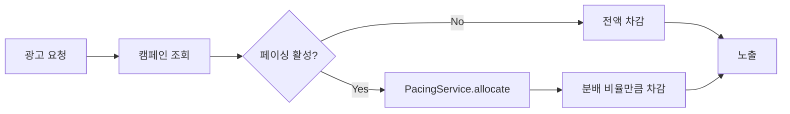

# Generation Style Guide (산출물 작성 가이드)

simon-bot이 생성하는 주요 산출물의 스타일, 구조, 품질 기준.

## 1. plan-summary.md 스타일 가이드

### Situation 섹션

3-5문장. 현재 상태 + 문제점을 명확히 기술한다.

**GOOD**:
```
현재 campaigns 테이블에는 예산 페이싱 관련 필드가 없다.
광고주가 일일 예산을 설정하면 서버에서 별도 처리 없이 전액이 즉시 소진되어,
오전에 예산이 고갈되고 오후에는 노출이 중단되는 문제가 반복된다.
이로 인해 광고 효과가 불균등하고, 광고주 이탈이 증가하고 있다.
```

**BAD**:
```
페이싱 기능이 필요하다. 현재 없어서 문제가 있다.
```

**BAD** (너무 장황):
```
2024년 3분기부터 광고주들의 피드백이 증가하고 있으며, 특히 중소 규모 광고주의
경우 일일 예산 설정 후 오전 시간대에 모든 예산이 소진되는 패턴이 관찰되었습니다.
이는 현재 시스템이 예산 분배 로직을 ... (10문장 이상 계속)
```

### Behavioral Checks

반드시 **Trigger + Observable + Verify Command** 3요소를 포함한다.

**GOOD**:
```markdown
- [ ] POST /campaigns (daily_budget: 10000) → 201 + pacing_enabled: true
      verify: curl -s localhost:8080/api/campaigns -d '{"daily_budget":10000}' | jq '.pacing_enabled'
- [ ] GET /campaigns/{id}/spend (오전 10시) → 일일 예산의 40% 이하 소진
      verify: curl -s localhost:8080/api/campaigns/1/spend | jq '.spent_ratio < 0.4'
```

**BAD** (Verify Command 누락):
```markdown
- [ ] 페이싱이 정상 동작해야 한다
- [ ] 예산이 균등하게 분배되어야 한다
```

**BAD** (Observable 모호):
```markdown
- [ ] POST /campaigns → 성공적으로 생성됨
      verify: curl localhost:8080/api/campaigns
```

### Files Changed 테이블

파일 경로 + 변경 유형(신규/수정/삭제) + 변경 이유를 한 문장으로 기술.

**GOOD**:
```markdown
| File | Action | Summary |
|------|--------|---------|
| internal/pacing/service.go | 신규 | 시간대별 예산 분배 비율을 계산하는 PacingService 구현 |
| internal/handler/campaign.go | 수정 | POST /campaigns 핸들러에 PacingService DI + 활성화 분기 추가 |
| db/migrations/20260319_add_pacing.sql | 신규 | campaigns 테이블에 pacing_enabled, daily_budget 컬럼 추가 |
```

**BAD**:
```markdown
| File | Action | Summary |
|------|--------|---------|
| internal/pacing/service.go | 신규 | 서비스 구현 |
| internal/handler/campaign.go | 수정 | 수정 |
```

### NOT in scope

구체적 항목을 명시한다. "기타"는 금지.

**GOOD**:
```markdown
## NOT in scope
- 실시간 대시보드 UI (별도 프론트엔드 태스크)
- 월간 예산 페이싱 (일일 예산만 지원, 월간은 Phase 2)
- 기존 캠페인 데이터 마이그레이션 (신규 캠페인부터 적용)
```

**BAD**:
```markdown
## NOT in scope
- 관련 없는 기능
- 기타 개선사항
```

## 2. Work Report (Step 18-A) 스타일 가이드

### 다이어그램

Mermaid 형식 사용 (GitHub PR에서 렌더링 가능).

**Before/After 흐름도 예시**:
````markdown
### Before


### After

````

### Key Review Points

변경 규모에 비례하여 **3-7개** 작성.

각 포인트에 포함할 요소:
- 무엇을 왜 변경했는지 (1줄)
- 핵심 코드 변경 스니펫 (Before/After)
- 특별히 주의 깊게 봐야 할 이유

**GOOD**:
```markdown
#### 1. PacingService의 시간대별 분배 알고리즘
일일 예산을 24시간에 균등 분배하되, 피크 시간(18-22시)에 1.5배 가중치를 적용한다.
가중치 값은 config에서 조정 가능하다.

> **리뷰 포인트**: 가중치 계산의 부동소수점 정밀도 — 24시간 합산이 정확히 100%가
> 되는지 확인 필요 (`pacing/service.go:45-67`)
```

### Trade-offs

**선택한 이유 + 기각한 대안 1개 이상**을 반드시 포함.

**GOOD**:
```markdown
## Trade-offs
### 시간대별 분배 vs 균등 분배
- **선택**: 시간대별 가중치 분배 — 피크 시간 노출 효과 극대화
- **기각**: 24시간 균등 분배 — 구현 단순하지만 심야 시간 예산 낭비
- **기각 사유**: 광고주 A/B 테스트에서 가중치 분배가 CTR 23% 향상
```

**BAD**:
```markdown
## Trade-offs
- 가중치 분배를 선택했다.
```

## 3. simon-bot-report 산출물 품질 기준

### 섹션별 기대 사양

| 섹션 | 기대 길이 | 구체성 수준 | 필수 포함 요소 |
|------|----------|-----------|--------------|
| **Summary** | 3-5줄 | 비개발자도 이해 가능 | 변경 목적, 핵심 결과, 영향 범위 |
| **Before/After 다이어그램** | 각 5-15 노드 | Mermaid 렌더링 가능 | 변경 전후 데이터/호출 흐름 |
| **Key Review Points** | 3-7개 | 코드 스니펫 포함 | 파일:줄, 변경 이유, 리뷰 포인트 |
| **Trade-offs** | 항목당 3-5줄 | 선택 + 기각 대안 | 선택 사유, 기각 대안 1개+, 기각 사유 |
| **Potential Risks** | 2-5개 | 발생 조건 + 완화 방안 | 리스크, 발생 확률(H/M/L), 완화 방안 |
| **Test Results** | 테이블 형식 | 테스트 분류별 | Happy/Edge/Error 건수, 커버리지 수치 |
| **NOT in scope** | 3-7개 | 구체적 항목 | 범위 밖 항목명 + 이유 또는 대안 시점 |
| **Unresolved Decisions** | 0-5개 | 결정 필요 사유 포함 | 항목, 영향, "may bite you later" 경고 |

### Review Sequence (18-B) 품질 기준

| 요소 | 필수 여부 | 설명 |
|------|----------|------|
| 제목 | 필수 | 논리적 변경 단위의 한 줄 요약 |
| 계획 매핑 | 필수 | plan-summary.md의 Unit/목표와의 대응 |
| 변경 이유 | 필수 | 왜 이 변경이 필요한지 |
| Before Context | 필수 | 변경 전 코드/모듈의 상태와 역할 |
| What Changed | 필수 | 구체적 변경 내용 |
| 관련 파일 | 필수 | 파일 경로 + 각 파일의 역할 |
| 핵심 코드 변경 | 필수 | Before/After diff (중요 부분 발췌) |
| 리뷰 포인트 | 필수 | 주의 깊게 봐야 할 부분 |
| 전문가 우려사항 반영 | STANDARD+ | Step 4-B/7 관련 우려 반영 내용 |
| 아키텍처 영향 분석 | STANDARD+ | 의존성 방향, 모듈 경계, 데이터 흐름 |
| 테스트 커버리지 요약 | 필수 | Happy/Edge/Error 분류 + 건수 |
| 영향 분석 | 필수 | 변경되지 않았지만 영향받는 코드 (1-depth) |

### 공통 작성 규칙

- **언어**: config.yaml의 `language` 설정 (기본: `ko`). 기술 용어는 영문 유지
- **길이**: 간결함 우선. 같은 정보를 더 짧게 전달할 수 있으면 짧게
- **코드 스니펫**: 핵심 변경만 발췌. 전체 파일 복사 금지
- **중복 금지**: report와 review-sequence에서 동일 내용 반복하지 않음. 상호 참조 사용
- **Mermaid 호환**: GitHub에서 렌더링 가능한 문법만 사용 (`graph`, `sequenceDiagram`, `flowchart`)
